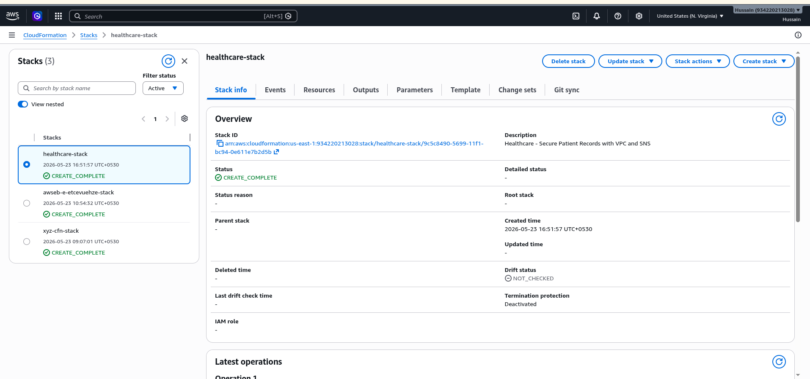
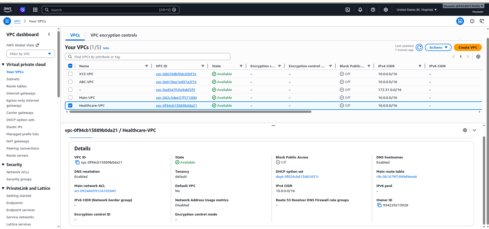
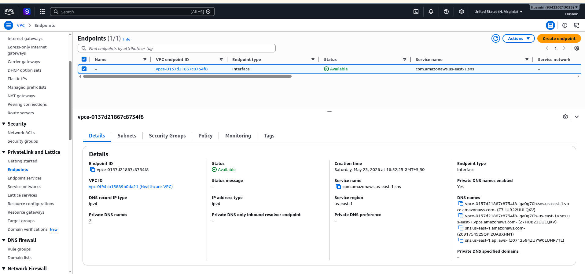
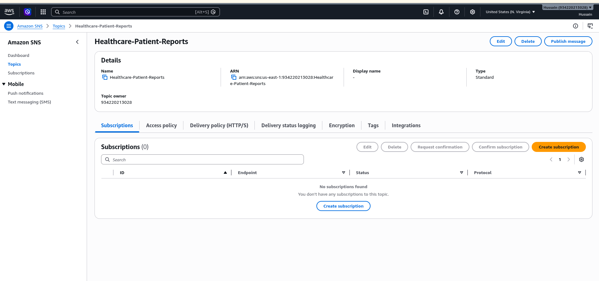
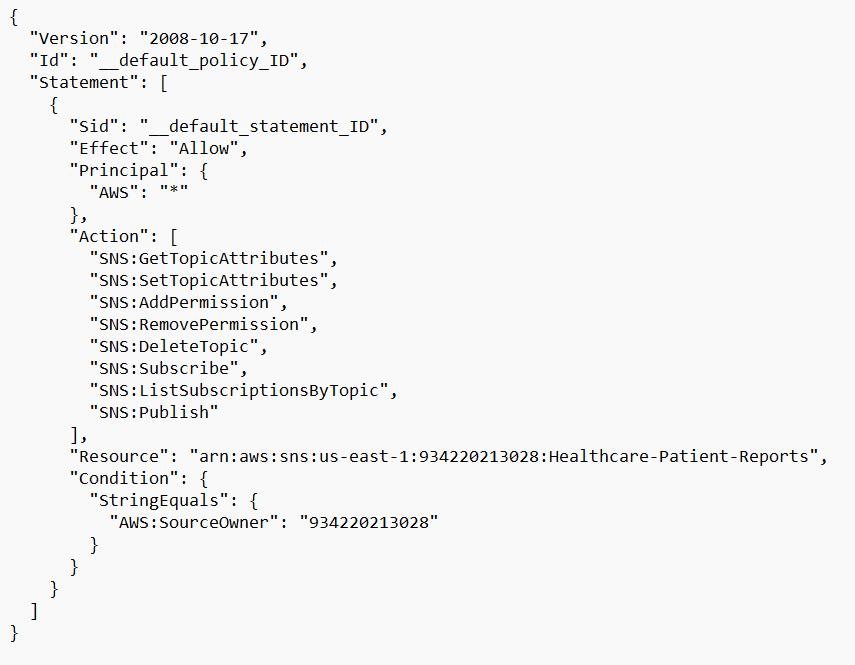
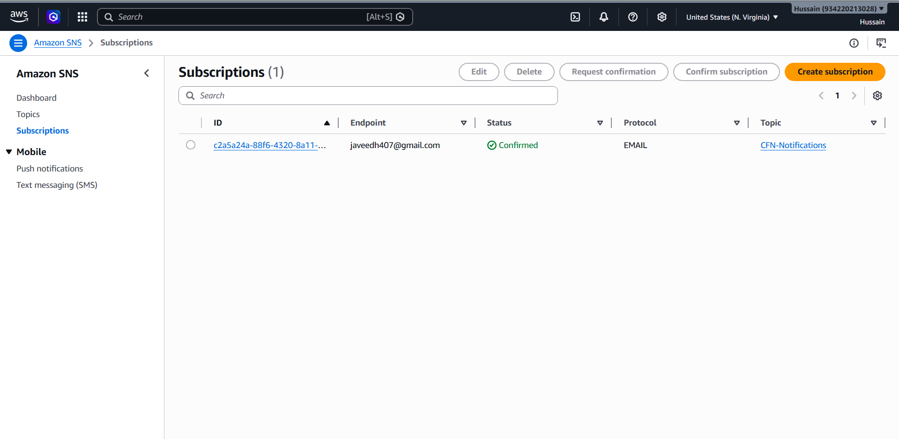
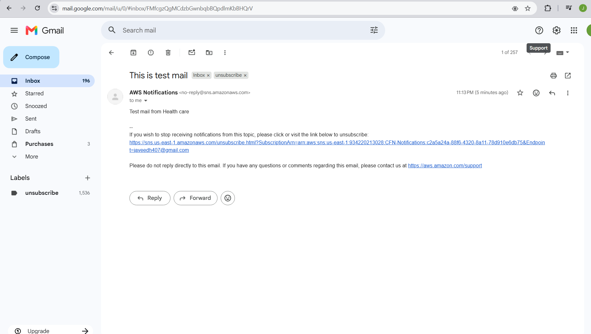

# Secure Patient Records & Private Notifications – Healthcare Platform

## Problem Statement
Hospitals need a secure way to send patient reports online to intended parties
without exposing sensitive medical data. This project builds a platform where
patients can access their reports via mobile and push notifications, published
privately through Amazon SNS within a secure AWS VPC.

---

## Architecture Overview

```
Hospital Application (EC2 inside VPC)
        ↓
  AWS CloudFormation (VPC Setup)
        ↓
  VPC Endpoint → Amazon SNS (Private Connection)
        ↓
  SNS Topic (Encrypted & Private)
        ↓
  Patient Mobile / Push Notifications
```

---

## Tools & Technologies Used

- **AWS CloudFormation** – Infrastructure as Code to create VPC
- **Amazon VPC** – Isolated private network for secure hosting
- **Amazon EC2** – Hosts the hospital application inside VPC
- **Amazon SNS** – Publishes patient reports as push notifications
- **VPC Endpoint** – Private connection between VPC and SNS (no public internet)
- **AWS IAM** – Access control and permissions
- **AWS KMS** – Encryption of SNS messages at rest

---

## 1. AWS CloudFormation – VPC Setup

CloudFormation is used to create the entire VPC infrastructure as code.

### cloudformation-vpc.yaml

```yaml
AWSTemplateFormatVersion: '2010-09-09'
Description: Secure VPC for Healthcare Patient Records Platform

Resources:

  HealthcareVPC:
    Type: AWS::EC2::VPC
    Properties:
      CidrBlock: 10.0.0.0/16
      EnableDnsSupport: true
      EnableDnsHostnames: true
      Tags:
        - Key: Name
          Value: Healthcare-VPC

  PublicSubnet:
    Type: AWS::EC2::Subnet
    Properties:
      VpcId: !Ref HealthcareVPC
      CidrBlock: 10.0.1.0/24
      AvailabilityZone: !Select [0, !GetAZs '']
      MapPublicIpOnLaunch: true
      Tags:
        - Key: Name
          Value: Public-Subnet

  PrivateSubnet:
    Type: AWS::EC2::Subnet
    Properties:
      VpcId: !Ref HealthcareVPC
      CidrBlock: 10.0.2.0/24
      AvailabilityZone: !Select [0, !GetAZs '']
      Tags:
        - Key: Name
          Value: Private-Subnet

  InternetGateway:
    Type: AWS::EC2::InternetGateway
    Properties:
      Tags:
        - Key: Name
          Value: Healthcare-IGW

  AttachGateway:
    Type: AWS::EC2::VPCGatewayAttachment
    Properties:
      VpcId: !Ref HealthcareVPC
      InternetGatewayId: !Ref InternetGateway

  PublicRouteTable:
    Type: AWS::EC2::RouteTable
    Properties:
      VpcId: !Ref HealthcareVPC
      Tags:
        - Key: Name
          Value: Public-RouteTable

  PublicRoute:
    Type: AWS::EC2::Route
    Properties:
      RouteTableId: !Ref PublicRouteTable
      DestinationCidrBlock: 0.0.0.0/0
      GatewayId: !Ref InternetGateway

  PublicSubnetRouteAssociation:
    Type: AWS::EC2::SubnetRouteTableAssociation
    Properties:
      SubnetId: !Ref PublicSubnet
      RouteTableId: !Ref PublicRouteTable

  EC2SecurityGroup:
    Type: AWS::EC2::SecurityGroup
    Properties:
      GroupDescription: Security group for Hospital EC2 instance
      VpcId: !Ref HealthcareVPC
      SecurityGroupIngress:
        - IpProtocol: tcp
          FromPort: 22
          ToPort: 22
          CidrIp: 0.0.0.0/0
        - IpProtocol: tcp
          FromPort: 80
          ToPort: 80
          CidrIp: 0.0.0.0/0
        - IpProtocol: tcp
          FromPort: 443
          ToPort: 443
          CidrIp: 0.0.0.0/0
      Tags:
        - Key: Name
          Value: Hospital-SG

  HospitalEC2:
    Type: AWS::EC2::Instance
    Properties:
      InstanceType: t2.micro
      ImageId: ami-0c55b159cbfafe1f0
      SubnetId: !Ref PrivateSubnet
      SecurityGroupIds:
        - !Ref EC2SecurityGroup
      Tags:
        - Key: Name
          Value: Hospital-App-Server

Outputs:
  VPCId:
    Description: VPC ID
    Value: !Ref HealthcareVPC

  PrivateSubnetId:
    Description: Private Subnet ID
    Value: !Ref PrivateSubnet

  EC2InstanceId:
    Description: Hospital EC2 Instance ID
    Value: !Ref HospitalEC2
```

---

## 2. VPC Endpoint – Connect VPC with AWS SNS

A VPC Interface Endpoint is created so the EC2 instance can communicate
with SNS **privately**, without traffic going over the public internet.
This ensures patient data never leaves the AWS private network.

### Why VPC Endpoint?

```
Without VPC Endpoint:
EC2 (Private Subnet) → Internet Gateway → Public Internet → SNS
                        ❌ Patient data exposed on public internet

With VPC Endpoint:
EC2 (Private Subnet) → VPC Endpoint → SNS (Private AWS Network)
                        ✅ Patient data stays within AWS private network
```

### CloudFormation – VPC Endpoint for SNS

```yaml
  SNSVPCEndpoint:
    Type: AWS::EC2::VPCEndpoint
    Properties:
      VpcId: !Ref HealthcareVPC
      ServiceName: !Sub 'com.amazonaws.${AWS::Region}.sns'
      VpcEndpointType: Interface
      SubnetIds:
        - !Ref PrivateSubnet
      SecurityGroupIds:
        - !Ref EC2SecurityGroup
      PrivateDnsEnabled: true
```

---

## 3. Amazon SNS – Secure Patient Notification Topic

### SNS Topic with Encryption (KMS)

```yaml
  PatientReportsTopic:
    Type: AWS::SNS::Topic
    Properties:
      TopicName: PatientReports
      DisplayName: Patient Medical Reports
      KmsMasterKeyId: alias/aws/sns
      Tags:
        - Key: Project
          Value: Healthcare
```

### SNS Topic Policy – Restrict to VPC Only

```yaml
  SNSTopicPolicy:
    Type: AWS::SNS::TopicPolicy
    Properties:
      Topics:
        - !Ref PatientReportsTopic
      PolicyDocument:
        Version: '2012-10-17'
        Statement:
          - Sid: AllowVPCOnly
            Effect: Allow
            Principal: '*'
            Action: sns:Publish
            Resource: !Ref PatientReportsTopic
            Condition:
              StringEquals:
                aws:SourceVpc: !Ref HealthcareVPC
          - Sid: DenyPublicAccess
            Effect: Deny
            Principal: '*'
            Action: sns:Publish
            Resource: !Ref PatientReportsTopic
            Condition:
              StringNotEquals:
                aws:SourceVpc: !Ref HealthcareVPC
```

---

## 4. Publishing Patient Reports Privately via SNS

The hospital application running on EC2 publishes patient reports to the
SNS topic. The message travels through the VPC Endpoint, never touching
the public internet.

### Python Script – Publish Report to SNS

```python
import boto3
import json

# SNS client – uses VPC Endpoint automatically (private DNS enabled)
sns_client = boto3.client('sns', region_name='us-east-1')

SNS_TOPIC_ARN = 'arn:aws:sns:us-east-1:<account-id>:PatientReports'

def publish_patient_report(patient_id, report_data):
    message = {
        "patient_id": patient_id,
        "report_type": report_data['type'],
        "report_summary": report_data['summary'],
        "doctor": report_data['doctor'],
        "date": report_data['date']
    }

    response = sns_client.publish(
        TopicArn=SNS_TOPIC_ARN,
        Message=json.dumps(message),
        Subject='Your Medical Report is Ready',
        MessageAttributes={
            'patient_id': {
                'DataType': 'String',
                'StringValue': patient_id
            },
            'report_type': {
                'DataType': 'String',
                'StringValue': report_data['type']
            }
        }
    )

    print(f"Message published. MessageId: {response['MessageId']}")
    return response

# Example usage
report = {
    "type": "Blood Test",
    "summary": "All values within normal range.",
    "doctor": "Dr. Sharma",
    "date": "2024-01-25"
}

publish_patient_report("P-10234", report)
```

---

## 5. SNS Subscriptions – Patient Mobile & Push Notifications

Patients subscribe to the SNS topic via mobile push or SMS to receive
their reports securely.

### Subscription Types Supported

| Subscription Type | Description |
|-------------------|-------------|
| Mobile Push (FCM) | Android push notification |
| Mobile Push (APNS) | iOS push notification |
| SMS | Text message to registered mobile number |
| Email | Secure email notification |
| HTTP/HTTPS | Webhook to hospital portal |

### Adding a Mobile Push Subscription (AWS Console / CLI)

```bash
# Subscribe a mobile endpoint to the SNS topic
aws sns subscribe \
  --topic-arn arn:aws:sns:us-east-1:<account-id>:PatientReports \
  --protocol application \
  --notification-endpoint <mobile-device-endpoint-arn>
```

---

## 6. Security Highlights

| Security Feature | Implementation |
|-----------------|----------------|
| Private network | EC2 hosted inside VPC private subnet |
| No public internet | VPC Endpoint connects EC2 to SNS privately |
| Encryption at rest | SNS topic encrypted with AWS KMS |
| Encryption in transit | HTTPS enforced on all communications |
| Access control | SNS topic policy restricts publish to VPC only |
| IAM roles | EC2 instance role with least privilege access |

---

## 7. Architecture Flow Diagram

```
Patient visits hospital → Doctor uploads report
              ↓
  Hospital App (EC2 – Private Subnet inside VPC)
              ↓
  VPC Interface Endpoint (Private DNS)
              ↓
  Amazon SNS Topic (PatientReports – KMS Encrypted)
              ↓
       ┌──────┼──────┐
       ↓      ↓      ↓
   Mobile   SMS    Email
   Push            Notification
  (FCM/APNS)
       ↓
  Patient receives secure report notification
```

---

## 8. CloudFormation Deployment Steps

```bash
# Step 1 – Deploy the CloudFormation stack
aws cloudformation create-stack \
  --stack-name healthcare-vpc-stack \
  --template-body file://cloudformation-vpc.yaml \
  --capabilities CAPABILITY_NAMED_IAM

# Step 2 – Check stack status
aws cloudformation describe-stacks \
  --stack-name healthcare-vpc-stack

# Step 3 – Publish a test message to SNS
aws sns publish \
  --topic-arn arn:aws:sns:us-east-1:<account-id>:PatientReports \
  --message "Your blood test report is ready. Please check the patient portal." \
  --subject "Medical Report Ready"
```

---

## Screenshots

### CloudFormation Stack – VPC Created


### VPC and Subnets


### VPC Endpoint for SNS


### SNS Topic – PatientReports


### SNS Topic Policy


### SNS Subscriptions


### Message Published Successfully


### Mobile Push Notification Received


---

## Key Learnings

- Created a secure AWS VPC using CloudFormation as Infrastructure as Code
- Hosted the hospital application on an EC2 instance within a private subnet
- Connected the VPC to Amazon SNS using a VPC Interface Endpoint
- Ensured all patient data travels privately without touching the public internet
- Encrypted SNS messages at rest using AWS KMS
- Restricted SNS publish access strictly to resources within the VPC
- Delivered patient reports securely via mobile push, SMS, and email notifications
